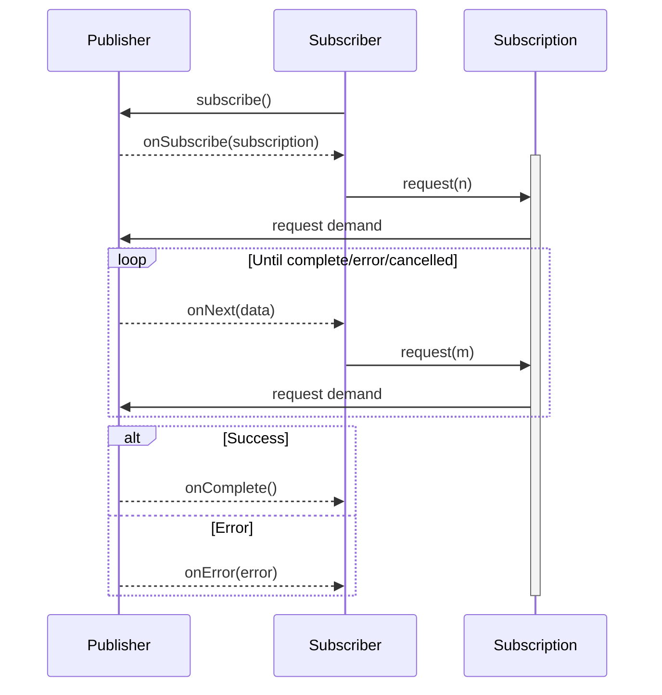
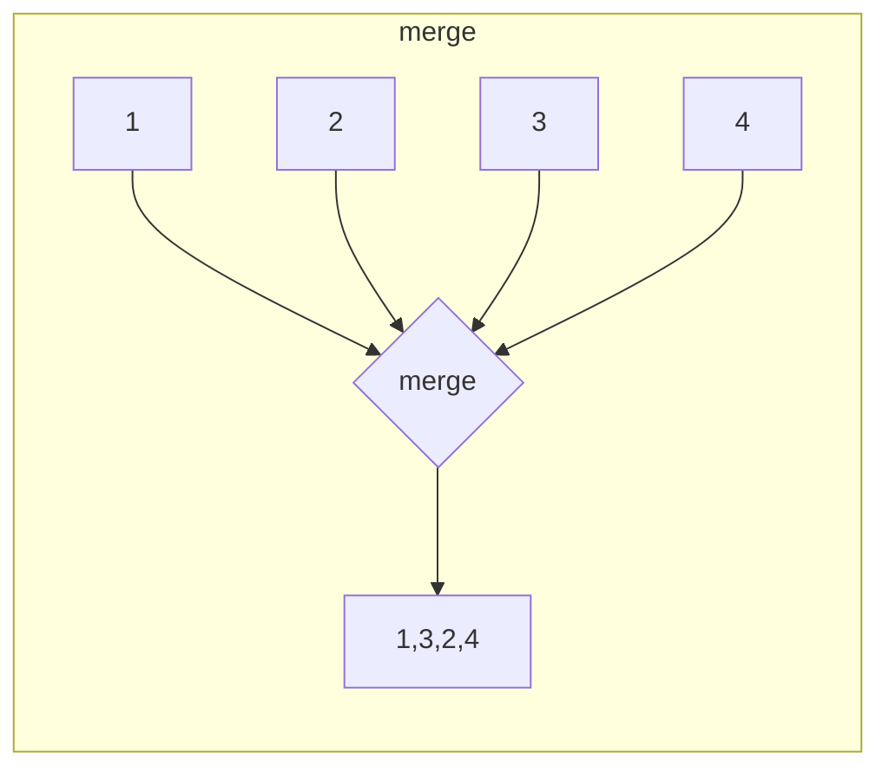
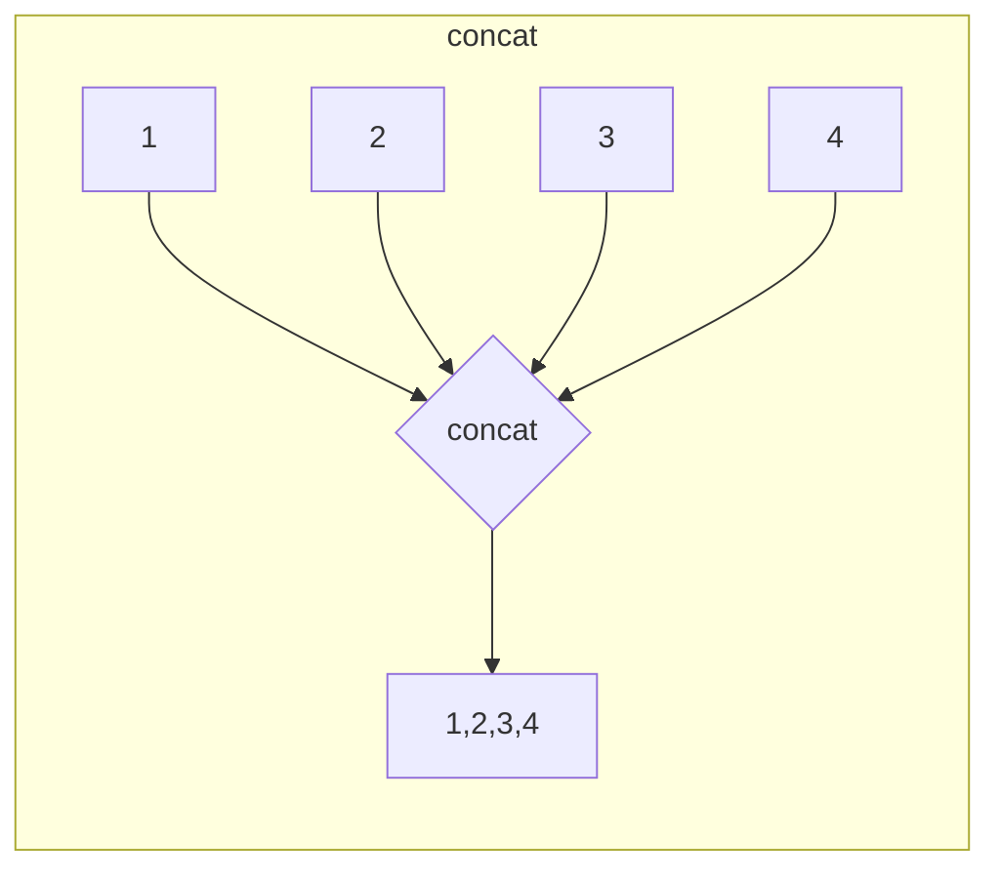
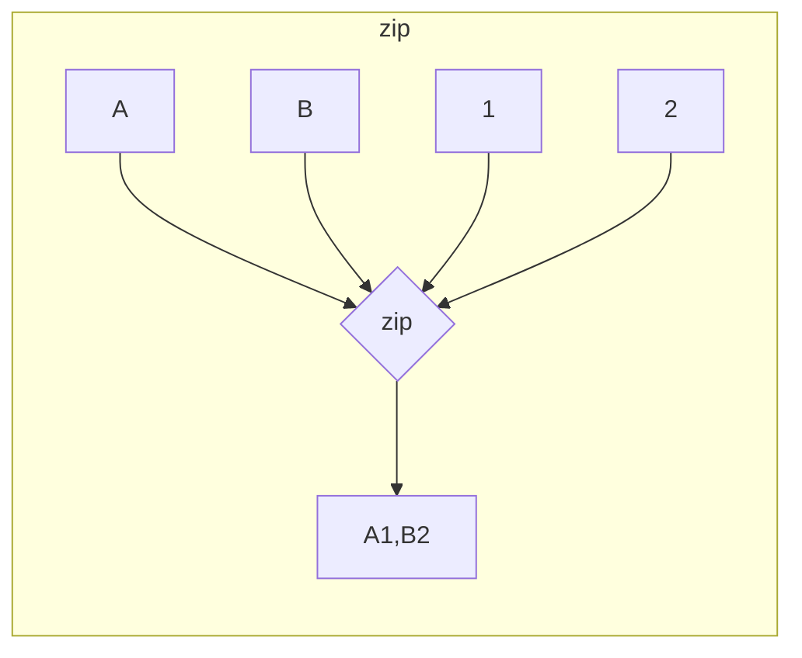
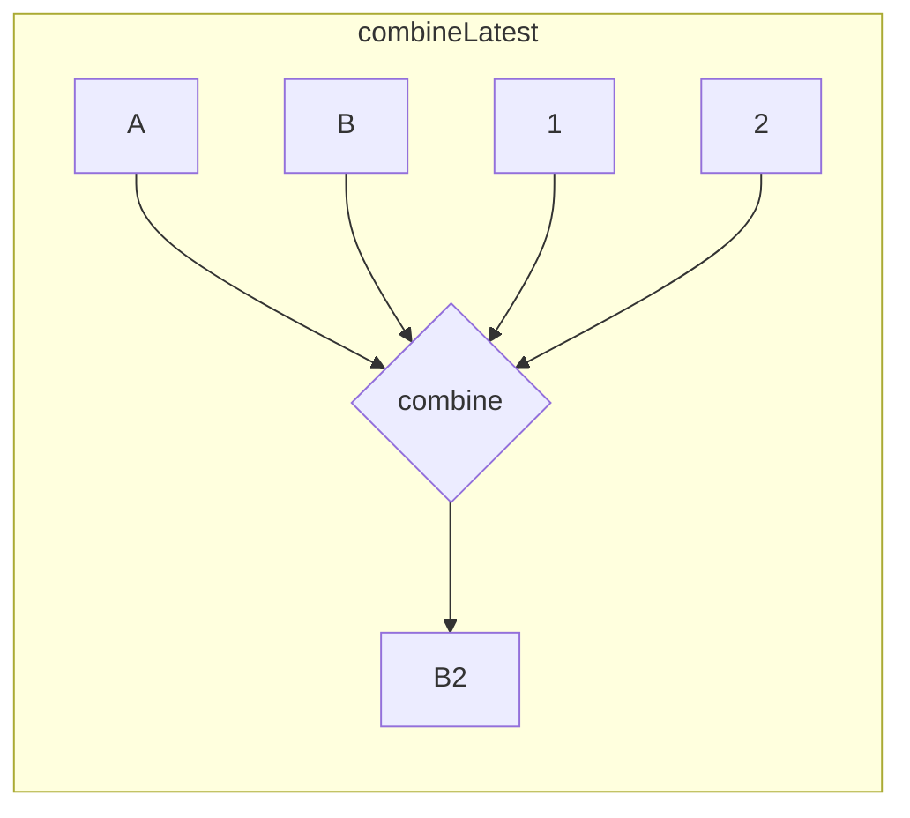
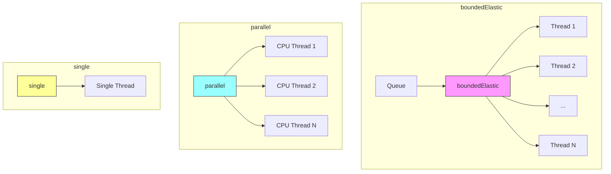
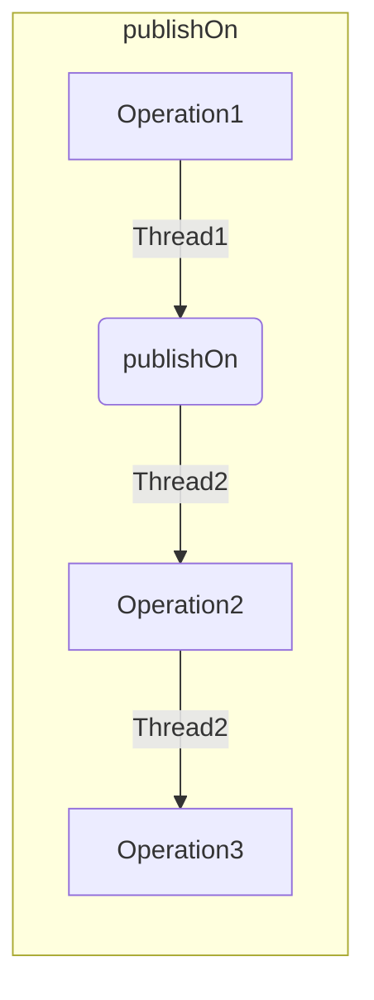
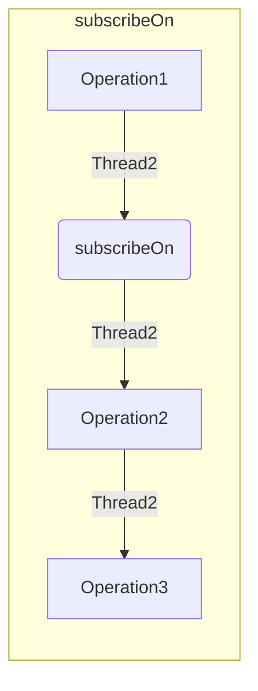

# Project Reactor Programming Guide

## Outline
1. [Core Concepts](#core-concepts)
   - [Operation Flow](#operation-flow)
   - [Backpressure](#backpressure)
   - [Reactive Streams](#reactive-streams)
   - [Mono & Flux Publishers](#mono--flux-publishers)

2. [Common Operators](#common-operators-by-category)
   - [Transformation](#transformation)
   - [Filtering](#filtering)
   - [Combination](#combination-examples)
   - [Reduction](#reduction)
   - [Side Effects](#side-effects)

3. [Execution Models](#sync-vs-async-operators)
   - [Synchronous Operators](#synchronous-operators)
   - [Asynchronous Operators](#asynchronous-operators)

4. [Error Handling](#error-handling)
   - [Fallback Values](#1-return-fallback-value)
   - [Backup Publishers](#2-switch-to-backup-publisher)
   - [Error Recovery](#3-continue-after-error-ignore)
   - [Retry Strategies](#4-retry-with-backoff)

5. [Schedulers and Threading](#schedulers-and-threading)
   - [Scheduler Types](#scheduler-types)
   - [Thread Management](#examples-of-schedulers-in-use)

6. [Advanced Topics](#advanced-topics)
   - [Hot vs Cold Publishers](#hot-vs-cold-publishers)
   - [Context Propagation](#context-propagation-downstream---upstream)

7. [Design Patterns & Best Practices](#2-design-patterns--best-practices)
   - [Common Reactive Patterns](#common-reactive-patterns)
   - [Performance Optimization](#performance-optimization)
   - [Testing Strategies](#testing-strategies)

8. [Appendix](#appendix)
   - [Core Concepts Deep Dive](#core-concepts-of-project-reactor)
   - [Mono and Flux Publishers](#mono-and-flux-publishers)
   - [Schedulers and Threading](#schedulers-and-threading-1)
   - [Hot vs Cold Publishers](#hot-vs-cold-publishers-1)
   - [Error Handling](#error-handling-1)
   - [Context Propagation](#context-propagation-in-project-reactor)

9. [Links](#links)

## Core Concepts

### Operation Flow
1. Publisher.subscribe(Subscriber) → creates Subscription
2. Subscriber.request(n) → signals demand (backpressure)
3. Publisher.onNext()/onComplete()/onError() → emits data



### Backpressure
- Subscriber controls emission rate via `request(n)` calls
- Handled via `limitRate`, `onBackpressureDrop`
- Each operator acts as Processor: upstream → transform → downstream
- Request flow: downstream → upstream

### Reactive Streams
```java
Publisher<T>     -> emit data
Subscriber<T>    -> consume data
Subscription     -> control demand (backpressure)
Processor<T,R>   -> transform data

// Protocol Flow:
1. Publisher.subscribe(Subscriber)
2. Publisher.onSubscribe(Subscription)
3. Subscription.request(n)      // Backpressure
4. Publisher.onNext(data) * n   // 0..n times
5. Publisher.onComplete()       // or onError()
```

### Mono & Flux Publishers

```java
// Mono: 0-1 items
Mono<T>   // async, lazy, single-value

// Flux: 0-N items
Flux<T>   // async, lazy, stream
```

```java
// Common Creation Methods
Mono.just(value)
Mono.fromCallable(() -> blockingCall())
Mono.defer(() -> dynamicMono())
Mono.empty()
Mono.error(ex)

Flux.just(1,2,3)
Flux.fromIterable(list)
Flux.range(1,10)
Flux.interval(Duration.ofSeconds(1))
```

## Common Operators by Category
```java
// Transformation
// See: [map docs][map]
map()           // 1-to-1 value change

// See: [flatMap docs][flatMap]
flatMap(        // 1-to-N async transform
    Function<T,Publisher<V>> mapper,   // Transform function
    int maxConcurrent,                 // Max parallel operations
    int prefetch,                      // Elements to prefetch
    int maxBufferSize                  // Internal buffer size
)

// See: [handle docs][handle]
handle((v,sink) -> {         // Stateful filter+map
    if (v % 2 == 0) {       // Filter condition
        sink.next(v * 2);    // Map transformation
    }
})
cast()          // type conversion

// Filtering
filter()        // keep matching
take(n)         // first n elements
skip(n)         // skip n elements
distinct()      // remove duplicates

// Combination Examples
// 1. merge: Interleave as they arrive
// See: [merge docs][merge]
Flux.merge(
    Flux.just(1,2,3),
    Flux.just(4,5,6)
) // -> 1,4,2,5,3,6 (order not guaranteed)

// 2. concat: Sequential append
// See: [concat docs][concat]
Flux.concat(
    Flux.just(1,2,3),
    Flux.just(4,5,6)
) // -> 1,2,3,4,5,6 (order guaranteed)

// 3. zip: Pair by position
// See: [zip docs][zip]
Flux.zip(
    Flux.just("A", "B", "C"),
    Flux.just(1, 2, 3),
    (letter, number) -> letter + number
) // -> A1, B2, C3

// 4. combineLatest: Latest pairs
// See: [combineLatest docs][combine]
Flux.combineLatest(
    Flux.just("A", "B", "C"),
    Flux.interval(Duration.ofMillis(100)),
    (letter, number) -> letter + number
) // -> C0, C1, C2...
```









```java
// Reduction
reduce()        // accumulate all
collect()       // gather into container
count()         // element count
all()/any()     // match predicate

// Side Effects
doOnNext()      // peek at values
doOnError()     // error handling
doFinally()     // cleanup
```

## Sync vs Async Operators

### Synchronous Operators
- Execute in same thread
- No concurrency introduced
```java
// map: pure transform (T → R)
flux.map(i -> i * 2)
    .filter(i -> i > 5)
    .reduce(0, Integer::sum)
```

Common sync operators:
- `map`: one-to-one transform
- `filter`, `take`, `reduce`: inline processing
- `publishOn`/`subscribeOn`: scheduling call only

### Asynchronous Operators
- May execute across threads
- Introduce concurrency
```java
// flatMap: async operations
flux.flatMap(i -> webClient.get()
        .uri("/api/{i}", i)
        .retrieve()
        .bodyToMono(Response.class))
    .mergeWith(otherFlux)
    .delayElements(Duration.ofMillis(100))
```

Common async operators:
- `flatMap`: async transformations
- `merge`/`zip`: combine streams
- `delay`/`interval`: timer operations

## Error Handling
```java
// See: [Error Handling Guide][errors]
// 1. Return Fallback Value
flux.onErrorReturn(                    // Static fallback
    IllegalStateException.class,       // Only for this error
    defaultValue                       // Fallback value
)

// 2. Switch to Backup Publisher
flux.onErrorResume(                    // Dynamic fallback
    TimeoutException.class,           // Only for this error
    ex -> backupService.getData())     // Backup publisher
)

// 3. Continue After Error (ignore)
flux.onErrorContinue(                  // Skip error, continue
    ValidationException.class,         // Only for this error
    (error, item) -> log.warn("Invalid: {}", item)
)

// 4. Retry with Backoff
flux.retryWhen(Retry.backoff(         // Exponential backoff
    3,                               // Max attempts
    Duration.ofMillis(100)           // Initial delay
).maxBackoff(Duration.ofSeconds(5))  // Max delay
)

// Common Patterns
service.getData()
    .timeout(Duration.ofSeconds(1))              // Timeout after 1s
    .onErrorResume(TimeoutException.class,       // On timeout
        ex -> backupService.getData())           // Use backup
    .onErrorReturn(IllegalStateException.class,  // On state error
        Collections.emptyList())                 // Return empty
    .doOnError(e -> metrics.recordError(e))      // Record all errors
    .retry(3)                                    // Retry 3 times [retry docs][retry]
```

## Schedulers and Threading
```java
// Default: subscriber's thread
flux.subscribe()

// Change thread context
flux.publishOn(scheduler)    // affects downstream
flux.subscribeOn(scheduler)  // affects whole chain

// Built-in schedulers API
Schedulers.boundedElastic(
    int threadCap,           // Max threads (default: CPU * 10)
    int queuedTaskCap,       // Max queued tasks (default: 100000)
    String name,             // Thread prefix (default: "boundedElastic")
    int ttlSeconds          // Thread TTL (default: 60)
)

Schedulers.newParallel(
    String name,            // Thread prefix
    int parallelism        // Thread count (default: CPU cores)
)

Schedulers.newSingle(
    String name,           // Thread prefix
    boolean daemon        // Daemon thread (default: false)
)

// Scheduler Types
boundedElastic() // I/O operations (default: cpu*10 threads)
parallel()       // CPU-intensive (default: cpu threads)
single()         // Sequential operations
immediate()      // Current thread
fromExecutorService(executor) // Custom thread pool
```







### Examples of Schedulers In Use

```java
// 1. boundedElastic() - Best for I/O
// Characteristics:
// - Creates worker pools as needed
// - Caps threads (CPU cores × 10)
// - Queues excess tasks
// - 60s idle timeout
// - Use for: I/O, blocking, JDBC
Flux.fromIterable(files)
    .flatMap(file -> Mono.fromCallable(() -> readFile(file))
        .subscribeOn(Schedulers.boundedElastic()))

// 2. parallel() - Best for CPU work
// Characteristics:
// - Fixed pool (CPU cores)
// - Never releases threads
// - Use for: computation, math
Flux.range(1, 100)
    .parallel()
    .runOn(Schedulers.parallel())
    .map(this::computeIntensive)
    .sequential()

// 3. single() - Best for ordering
// Characteristics:
// - Single worker thread
// - Reused across calls
// - Use for: sequential ops
Flux.range(1, 100)
    .publishOn(Schedulers.single())
    .map(i -> performSequentialOperation(i))

// 4. immediate() - No threading
// Characteristics:
// - Uses caller's thread
// - No thread overhead
// - Use for: testing, debug
Flux.range(1, 100)
    .publishOn(Schedulers.immediate())
    .map(i -> i * 2)
```
## Advanced Topics

### Hot vs Cold Publishers
```java
// Cold Publishers (Default)
// - Replay full sequence per subscriber
// - Good for: HTTP calls, File reads
Flux<Response> cold = webClient.get()
    .uri("/data")
    .retrieve()
    .bodyToFlux(Response.class);

// Hot Publishers
// - Share live data across subscribers
// - Good for: WebSocket feeds, Message queues
Sinks.Many<Event> hot = Sinks.many().multicast().onBackpressureBuffer();
hot.asFlux()
   .subscribe(user1::process);  // Gets events from subscription
hot.asFlux()
   .subscribe(user2::process);  // Gets only new events
hot.tryEmitNext(newEvent);      // Both users get this

// Convert Cold to Hot
// Use when: Multiple subscribers need same data
Flux<Market> market = coldSource.publish().autoConnect(2);
market.subscribe(trader1::process);  // Waits
market.subscribe(trader2::process);  // Both start receiving
```

### Context Propagation (Downstream -> Upstream)
```java
// Context flows opposite to data
Mono.deferContextual(ctx -> 
    Mono.just("User:" + ctx.get("user"))
)
.contextWrite(Context.of("user", "john"))
.subscribe(System.out::println); // "User:john"
```

## 2. Design Patterns & Best Practices

### Common Reactive Patterns

```java
// 1. Circuit Breaker
// Use: Prevent cascade failures
Mono<Response> withBreaker(Request req) {
    return Mono.just(req)
        .transform(CircuitBreaker.create("api")
                .run())
            .timeout(Duration.ofSeconds(1))
        .retryWhen(Retry.backoff(3, Duration.ofMillis(100)))
        .onErrorResume(ex -> fallback(req));
}

// 2. Bulkhead
// Use: Isolate failures between systems
class BulkheadExample {
    private final Scheduler dedicated = 
        Schedulers.newBoundedElastic(10, 100, "api");
    
    Mono<Response> isolatedCall() {
        return Mono.fromCallable(this::externalCall)
            .subscribeOn(dedicated)
            .timeout(Duration.ofSeconds(5));
    }
}

// 3. Cache
// Use: Optimize repeated requests
class CachePattern {
    private final LoadingCache<String, Mono<Data>> cache = 
        Caffeine.newBuilder()
            .expireAfterWrite(Duration.ofMinutes(5))
            .buildAsync(key -> fetchData(key).cache());
    
    Mono<Data> getCached(String key) {
        return Mono.fromFuture(cache.get(key))
            .onErrorResume(ex -> refetch(key));
    }
}

// 4. Saga
// Use: Distributed transactions with rollback
class OrderSaga {
    Mono<Order> placeOrder(Order order) {
        return validateOrder(order)
            .flatMap(this::reserveInventory)
            .flatMap(this::processPayment)
            .flatMap(this::shipOrder)
            .doOnError(ex -> rollback(order))
            .timeout(Duration.ofMinutes(1));
    }
    
    private Mono<Void> rollback(Order order) {
        return Flux.concat(
            releaseInventory(order),
            refundPayment(order),
            cancelShipment(order)
                ).then();
    }
}

// 5. Rate Limiter
// Use: Control request rates
// Rate Limiter Components:
// 1. boundedElastic: Dedicated thread pool
//    - Prevents blocking main thread
//    - Caps max concurrent operations
// 2. delayElements: Time-based throttling
//    - Ensures minimum time between emissions
//    - Works with scheduler for precise timing
// 3. flatMap(maxConcurrent): Concurrency control
//    - Limits parallel requests
//    - Prevents overwhelming downstream
class RateLimiter {
    private final Scheduler scheduler = 
        Schedulers.newBoundedElastic(1, 100, "limiter");
    
    Flux<Response> limitedRequests(Flux<Request> reqs) {
        return reqs.flatMap(
            req -> processRequest(req),
            maxConcurrent = 10
        ).delayElements(
            Duration.ofMillis(100),
            scheduler
        );
    }
}
```

### Performance Optimization

```java
// Batching & Buffering
// Backpressure Strategies:
// See: [Backpressure Guide][backpressure]
onBackpressureBuffer(
    int maxSize,                       // Max elements to buffer
    BufferOverflowStrategy strategy    // What to do when full
)
// Strategies:
// - DROP_OLDEST  : Remove first element
// - DROP_LATEST : Ignore new element
// - ERROR       : Signal error
Flux<List<Event>> batchEvents(Flux<Event> source) {
        return source
        .bufferTimeout(100, Duration.ofMillis(50))  // Size or time
        .onBackpressureBuffer(10_000, BufferOverflowStrategy.DROP_OLDEST);
}

// Prefetch Tuning
Flux<Data> optimizedPrefetch(Flux<Request> reqs) {
    return reqs.flatMap(
        r -> process(r),
        maxConcurrent = 8,    // Parallel processes
        prefetch = 32         // Items pre-fetched
    );
}

// Memory Management
// Flux.using(
//   resourceSupplier,    // () -> R : Create resource
//   resourceHandler,     // R -> Publisher<T> : Use resource
//   resourceCleanup,     // R -> void : Cleanup
//   eager              // true: cleanup after complete/error
//                      // false: cleanup after cancel
// )
// See: [using docs][using]
class ResourceManagement {
    Flux<Data> withCleanup(Resource resource) {
        return Flux.using(
            () -> resource,           // Acquire
            r -> process(r),          // Use
            Resource::close,          // Cleanup
            true                      // Eager cleanup
            );
    }
}
```

### Testing Strategies

```java
// Unit Testing with StepVerifier
// StepVerifier: Declarative testing tool
// - Verifies publisher behavior
// - Handles async operations
// - Controls virtual time
// Common operations:
// .expectNext(T...)     : Verify next values
// .expectNextCount(n)   : Skip n values
// .expectComplete()     : Verify completion
// .expectError()        : Verify error
// .thenAwait(duration) : Wait time
// .verify(duration)    : Run verification

@Test
void testReactiveFlow() {
    Flux<String> source = service.getData();
    
    StepVerifier.create(source)
        .expectNext("a", "b")
        .expectComplete()
        .verify(Duration.ofSeconds(5));
}

// Virtual Time Testing
// Virtual Time Testing Options:
// 1. Time Control
// - withVirtualTime(() -> publisher) : Create time-traveling test
// - thenAwait(Duration)             : Fast-forward time
// - expectNoEvent(Duration)         : Verify silence period
// - verifyComplete(Duration)        : Set test timeout
//
// 2. Verification Methods
// - expectSubscription()            : Verify setup
// - expectNext(T...)               : Assert values
// - expectNextCount(n)             : Skip n values
// - expectNextSequence(Iterable)   : Assert sequence
// - expectComplete()               : Assert completion
// - expectError(Class)             : Assert error type
//
// 3. Advanced Options
// - thenAwait()                    : Wait indefinitely
// - thenCancel()                   : Simulate cancellation
// - verifyTimeout(Duration)        : Assert timeout occurs
// - recordWith(Collection)         : Capture emissions
// - consumeNextWith(Consumer)      : Custom verification
@Test
void testTimeBasedOps() {
    StepVerifier.withVirtualTime(() -> 
        Flux.interval(Duration.ofHours(1)).take(2)
    )
    .expectSubscription()          // Verify subscription setup
    .expectNoEvent(Duration.ofHours(1))  // Nothing for 1h
    .expectNext(0L)                // First emission
    .thenAwait(Duration.ofHours(1))     // Skip ahead 1h
    .expectNext(1L)                // Second emission
    .verifyComplete();             // Done
}

// Example: Testing timeouts
@Test
void testTimeout() {
    StepVerifier.withVirtualTime(() ->
        Mono.delay(Duration.ofSeconds(2))
            .timeout(Duration.ofSeconds(1))
    )
    .expectSubscription()
    .expectNoEvent(Duration.ofSeconds(1))
    .expectError(TimeoutException.class)
    .verify();
}
```

### Common Anti-patterns & Pitfalls

```java
// DON'T: Block in reactive chain
Flux.just(1,2,3)
    .map(i -> {
        Thread.sleep(100);    // WRONG!
        return process(i);
    })

// DO: Use proper async wrapper
Flux.just(1,2,3)
    .flatMap(i -> Mono
        .fromCallable(() -> {
            Thread.sleep(100);
            return process(i);
        })
        .subscribeOn(Schedulers.boundedElastic())
    )

// DON'T: Unbounded concurrency
source.flatMap(item -> 
    service.process(item), 
    Integer.MAX_VALUE        // WRONG!
)

// DO: Limit concurrency
source.flatMap(item ->
    service.process(item),
    maxConcurrent = 10      // RIGHT!
)

// DON'T: Ignore errors
flux.subscribe(
    data -> process(data)   // WRONG: No error handler
)

// DO: Handle errors
flux.subscribe(
    data -> process(data),
    error -> handleError(error)
)
```

### Best Practices

```java
// 1. Scheduler Selection
class SchedulerUsage {
    // GOOD: I/O operations
    Mono<Data> ioOperation() {
        return Mono.fromCallable(() -> readFile())
            .subscribeOn(Schedulers.boundedElastic());
    }
    
    // GOOD: CPU-intensive tasks
    Flux<Data> computeIntensive() {
        return Flux.range(1, 1000)
            .parallel()
            .runOn(Schedulers.parallel())
            .map(this::heavyComputation)
            .sequential();
    }
}

// 2. Custom Thread Pools
class CustomThreadPools {
    private final Scheduler customPool = Schedulers.newBoundedElastic(
        Runtime.getRuntime().availableProcessors() * 2,  // threads
        1000,                                           // queue size
        "api-pool"
    );
    
    Mono<Response> apiCall() {
        return Mono.fromCallable(() -> externalCall())
            .subscribeOn(customPool)
            .doFinally(signal -> {
                if (isShuttingDown) customPool.dispose();
            });
    }
}

// 3. Metrics & Monitoring
class MetricsExample {
    Mono<Data> trackedOperation(String opName) {
        return Mono.fromCallable(() -> operation())
            .name(opName)
            .tag("type", "business")
            .metrics()
            .transformDeferred(mono -> 
                mono.doOnSubscribe(s -> recordStart(opName))
                   .doFinally(s -> recordEnd(opName))
            );
    }
}
```


## Next Steps
1. Practice with [Project Reactor Test](https://github.com/reactor/reactor-core/tree/main/reactor-test)
2. Explore [Reactor Debugging Guide](https://projectreactor.io/docs/core/release/reference/#debugging)
3. Join [Reactor Gitter](https://gitter.im/reactor/reactor)


## APPENDIX

# Core Concepts of Project Reactor

## Mono and Flux Publishers
- `Mono<T>` represents a lazy, potentially asynchronous computation that can emit at most one item (0 or 1) and then complete (or error).
- `Flux<T>` represents a lazy, potentially asynchronous emission of 0 to N items. After the final element, it either completes or terminates with an error.

You typically interact with values through operators such as `map`, `flatMap`, `filter`, or `reduce`. The processing does not start until you call `subscribe()`.

## Schedulers and Threading
By default, work executes in whichever thread calls `subscribe()`, but you can use:
- `publishOn(scheduler)` to switch execution contexts starting from that point in the chain (affects ensuing operators).
- `subscribeOn(scheduler)` to switch execution contexts at subscription time (affects the whole chain, starting at the source).

Built-in schedulers include:
- `Schedulers.boundedElastic()` for blocking I/O work.
- `Schedulers.parallel()` for CPU-intensive tasks.

You can also create your own via `Schedulers.newBoundedElastic(...)` or `Schedulers.fromExecutor(...)`.


## Hot vs. Cold Publishers
- A cold publisher (the default for most Flux and Mono) starts emitting items when subscribed to. Each new Subscriber sees the entire sequence from the beginning.
- A hot publisher emits items regardless of whether anyone is subscribed; late subscribers may miss prior signals.

## Error Handling
Error signals end the sequence (similar to throwing an exception), but Reactor offers recovery operators:
- `onErrorReturn(...)` to provide a fallback value.
- `onErrorResume(...)` to switch to a fallback publisher.
- `retry(...)` to re-subscribe when encountering particular errors.

For advanced usage, combine `doOnError(...)` side effects with `onErrorMap(...)`, `onErrorContinue(...)`, etc.

## ConnectableFlux

Controls subscription timing for multiple subscribers. Used to:
- Convert cold → hot publishers
- Share subscriptions
- Manage late subscribers

### Basic Usage
```java
// Manual control
ConnectableFlux<Long> flux = Flux.interval(Duration.ofSeconds(1))
    .publish();
flux.subscribe(i -> log.info("Sub1: {}", i));
flux.subscribe(i -> log.info("Sub2: {}", i));
flux.connect();  // Starts emission
```

### Common Patterns
```java
Flux.range(1, 3)
    .publish()
    .autoConnect(2);     // Start with N subscribers
    .refCount(1);        // Start with first sub, stop when last leaves
    .refCount(1, Duration.ofSeconds(1));  // Grace period before stopping
```

## Context Propagation in Project Reactor

### What is Context Propagation?

ThreadLocal-like functionality for reactive streams, preserving context across async boundaries.

### Use Cases
- Distributed tracing
- Security context
- Transaction metadata
- MDC logging
- Request scoping

### Core Concepts
- Immutable
- Flows downstream → upstream
- Subscription-scoped
- Read: `deferContextual()`
- Write: `contextWrite()`

### Basic Usage
```java
// Write context
Mono<Response> withContext = service.process()
    .contextWrite(Context.of("userId", "123"));

// Read context
Mono<String> readContext = Mono.deferContextual(ctx ->
    Mono.just("User: " + ctx.getOrDefault("userId", "anonymous"))
);

// Combine read/write
Mono<String> process = Mono.deferContextual(ctx -> {
    String userId = ctx.get("userId");
    return callService(userId)
        .contextWrite(Context.of("traceId", "xyz"));
});
```

### Automatic Propagation (3.5.0+)
```java
// Enable ThreadLocal propagation
Hooks.enableAutomaticContextPropagation();

ThreadLocal<String> threadLocal = new ThreadLocal<>();
threadLocal.set("value");

Mono.defer(() -> Mono.just(threadLocal.get()))
    .publishOn(Schedulers.boundedElastic())
    .subscribe(); // ThreadLocal value preserved
```

### Context : Do and Don't
```java
// DO: Immutable updates
mono.contextWrite(ctx -> ctx.put("key", "value"))

// DO: Default values
ctx.getOrDefault("key", "default")

// DON'T: Store context
Context globalCtx; // Wrong!

// DON'T: Modify directly
ctx.put("key", "value"); // Wrong!
```

Context propagation is particularly useful in microservices architectures where you need to maintain contextual information across service boundaries and asynchronous operations. It provides a clean way to pass metadata without polluting your business logic or method signatures.

# Links 

[map]: https://projectreactor.io/docs/core/release/api/reactor/core/publisher/Flux.html#map-java.util.function.Function-
[flatMap]: https://projectreactor.io/docs/core/release/api/reactor/core/publisher/Flux.html#flatMap-java.util.function.Function-
[handle]: https://projectreactor.io/docs/core/release/api/reactor/core/publisher/Flux.html#handle-java.util.function.BiConsumer-
[merge]: https://projectreactor.io/docs/core/release/api/reactor/core/publisher/Flux.html#merge-org.reactivestreams.Publisher...-
[concat]: https://projectreactor.io/docs/core/release/api/reactor/core/publisher/Flux.html#concat-org.reactivestreams.Publisher...-
[zip]: https://projectreactor.io/docs/core/release/api/reactor/core/publisher/Flux.html#zip-org.reactivestreams.Publisher-org.reactivestreams.Publisher-
[combine]: https://projectreactor.io/docs/core/release/api/reactor/core/publisher/Flux.html#combineLatest-java.util.function.Function-org.reactivestreams.Publisher...-
[errors]: https://projectreactor.io/docs/core/release/reference/#error.handling
[retry]: https://projectreactor.io/docs/core/release/api/reactor/util/retry/Retry.html
[backpressure]: https://projectreactor.io/docs/core/release/reference/#backpressure
[using]: https://projectreactor.io/docs/core/release/api/reactor/core/publisher/Flux.html#using-java.util.concurrent.Callable-java.util.function.Function-java.util.function.Consumer-

